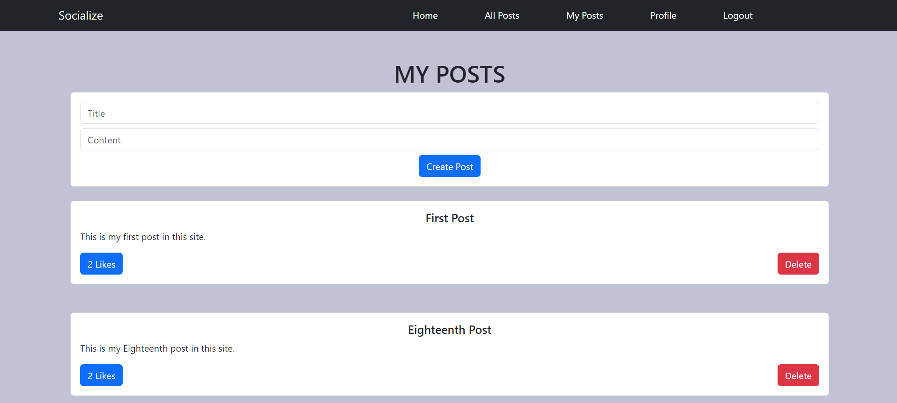

# Welcome to Tattoo Studio 🎨

 ## Table of Contents 🗂️
<details>
  <summary></summary>
  <ol>
    <li><a href="#about-the-project">About the project 📋</a></li>
    <li><a href="#getting-started">Getting started 🚀</a></li>
    <li><a href="#stack">Stack ⚓</a></li>
    <li><a href="#views">Views 📈</a></li>
    <li><a href="#endpoints">Endpoints 📌</a></li>
    <li><a href="#futuras-funcionalidades">Future features ⚙️</a></li>
    <li><a href="#contribuciones">Suggestions and contributions ❓</a></li>
    <li><a href="#licencia">License 🔑</a></li>
    <li><a href="#author">Author ✍️</a></li>
    <li><a href="#acknowledgments">Acknowledgments 🎓</a></li>
  </ol>
</details>

<div id="about-the-project"></div>

## About the project 📋
This is a Front End made for a fictitious social network. This app contains views to login, register, view all post and delete as admin, view your own post, the landing page and see, create, delete and like posts. This is project made to start learning react and how to work between Frontend and Backend.

<div id="getting-started"></div>

## Getting Started (Local) 	🚀
1. Download this respository zip or use git clone repository.
2. Use the next command to install all the apps dependencies: ` $ npm install `
3. Then go to this respository and follow the steps. [Backend](https://github.com/guillermogm/SocialNetwork)
4. You can also change the port and the secret to encryct your passwords.
5. To start the servapper use `npm run dev` and to stop it use control c in the terminal.


<div id="stack"></div> 

## Stack ⚓
Tecnologies used:
<div align="center">
<a>
    
</a>
<a>
    
</a>
<a>
    
</a>
<a>
    
</a>
<a>

</a>
<a>
    
</a>
<a>
    
</a>
<a>
    
</a>
<a>
    
</a>
<a>
    
</a>
<a>
    
</a>
<a>
    
</a>
</div>

<div id="views"></div>

## Views 📈
Landing
  
Register

Login Example(User:emilychen@email.com, 123456789)

Profile

Admin Example(Admin: superadmin@superadmin.com, 123456789)

All posts

My posts



<div id="futuras-funcionalidades"> </div>

## Future features ⚙️
[ ] View of a post in detail.<br/>
[ ]Modification of a post as ADMIN.<br/>
[ ]Search bar for users and posts.<br/>
[ ]Data validation (check that the data entered is correct before sending it to the backend, etc.).<br/>
[ ]Error management (informational messages from the expected password format to errors from the backend).<br/>

<div id="contribuciones"></div>

## Suggestions and contributions ❓
Suggestions and contributions are always welcome.

You can do it in two different ways:

1. Create a github issue.
2. Create a fork of this repository
    - New branch 
        ```
        $ git checkout -b feature/userName-improvement
        ```
    - Commit with your changes 
        ```
        $ git commit -m 'feat: upgrade X feature'
        ```
    - Push the branch 
        ```
        $ git push origin feature/userName-improvement
        ```
    - Open a Pull Request.

<div id="licencia"></div>

## License 🔑
This project is licensed by guillermogm

 <div id="author"></div>

## Author ✍️
* Guillermo Gómez:
    * [GitHub](https://github.com/guillermogm)

<div id="acknowledgments"></div>

## Acknowledgements 🎓
* A shoutout to the teachers at Geekshubs Academy.